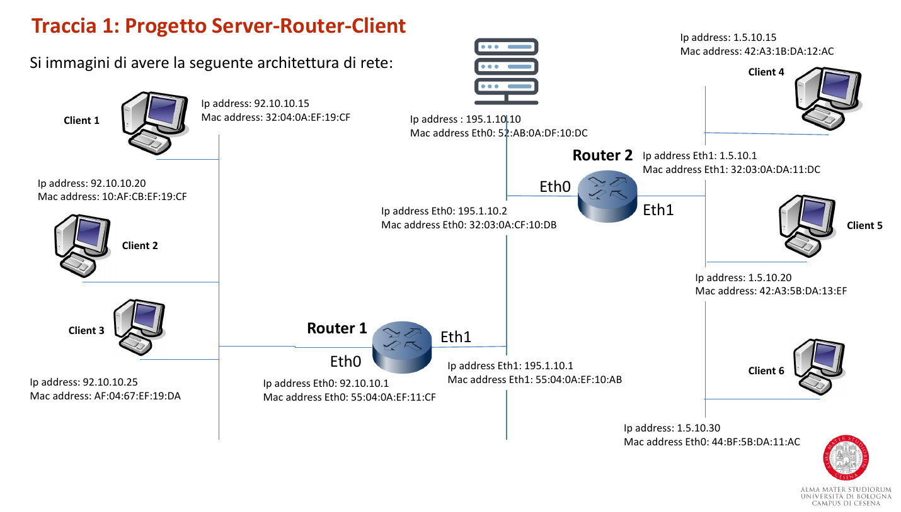

# Progetto Traccia 1

Progetto per l'esame di programmazione di reti.



Per lanciare tutti i componenti presenti nel disegno di rete ho creato lo script
[launcher.sh](./launcher.sh), testato su arch linux 5.7.3-arch1-1 x86-64 e python 3.8.3

## Librerie

L'unica libreria esterna di python usata è [construct](https://pypi.org/project/construct/)

`pip install -r requirements.txt`

Questa libreria mi permette di fare un parsing efficace dei pacchetti del tipo:

```
mac src | mac dst | ip src | ip dst
```

Su arch linux è inoltre necessario installare tkinter con:

`sudo pacman -S tk`

## Clients

Ogni client ha una semplice GUI con tkinter, le opzioni sono:

1. Online -> Si riferisce al server che il client è online, questo pacchetto è mandato di default all'avvio del client.
2. Offline -> Si riferisce al server che il client è offline.
3. Get Clients -> Si richiede al server la lista dei client online.
4. Message -> Si può mandare un messaggio privato a un altro client, in una textbox è necessario inserire il messaggio da mandare e nell'altra l'IP del client di destinazione.
5. Broadcast -> Si può mandare un messaggio a tutti i client online.

**IMPORTANTE**: Per usare queste opzioni è necessario selezionare la listbox prima di premere il tasto "send".

Il client è single-thread poichè l'unica connessione che deve fare è al server (tramite il router).

## Router

I router sono asincroni e sono basati su [asyncore](https://docs.python.org/3/library/asyncore.html),
questo permette una maggiore flessibilità e un consumo minore di risorse del sistema.

Ogni client si collega al router della propria LAN, Ogni connessione viene poi delegata al `ClientHandler`.
Quest'ultimo poi leggerà il pacchetto con l'ip di destinazione (server) e aprirà una connessione con un nuovo socket ad esso.
La connessione con la nuova coppia di socket router <--> server sarà poi delegata al `ServerHandler`,
il quale ha tra i vari campi l'oggetto ClientHandler da cui è stato creato.
In questo modo il router farà comunicare ogni client con il server transparentemente.

Il router2 ha la stessa logica ma invece che connettersi al server si connetterà
al router1 che è il default gateway del server.

Il router ha una routing table statica che permette di fare il routing in base ai
vari indirizzi ip.

Il router implementa anche un meccanismo per riconoscere un attacco di tipo MAC Spoofing,
ovvero quando due client hanno lo stesso MAC, tramite un apposita arp table.

## Server

Il server è asincrono e anch'esso basato su asyncore. Tiene una lista di client attivi e riesce
a parsare i vari tipi di messaggio ricevuti e fare comunicare i client nella rete
con il supporto dei router.

